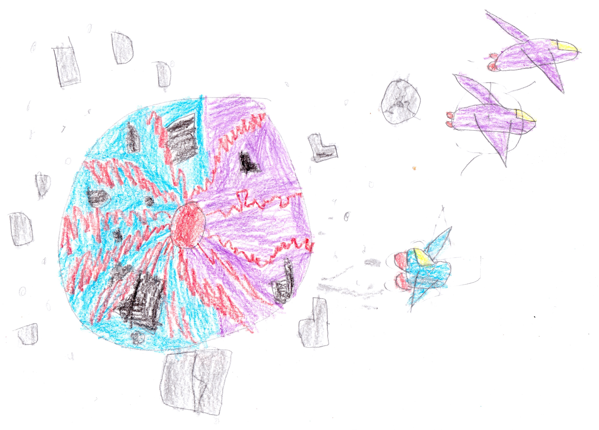

--- 
title: "Kitty's Story"
subtitle: "A New Series"
author: "by Beckett and Felix "
date: "`r Sys.Date()`"
site: bookdown::bookdown_site
documentclass: krantz
fontsize: 12pt
classoption: oneside
description: "A New Series about Kitty"
cover-image: "img/catplanet.jpg"
favicon: "img/cat-favicon.ico"
github-repo: "bwstephens/kitty-story"
---

# Preface {-}

We wanted to do something different in this book. I wanted to do a joint work with my brother, Felix, so I had the idea of writing a book about his stuff cat, Kitty. Felix came up with with the story about Cat Planet. It was natural for me to write down the story and then have Felix color the pictures. This was a fun collaboration, and we're already planning the next book in the series. We hope you enjoy this new series.

# About the Authors {-}

Beckett is an aspiring author and illustrator. Beckett also loves Minecraft, Lego's, and Transformers, as well as making up endless stories while he walks. 

Felix loves to draw. When he isn't coloring Felix likes to play Lego's and transformers. He also loves cats because they make him feel happy. He has a stuffed animal named Kitty.

# Acknowledgements {-}

Thanks to Dad for helping us publish this book online.